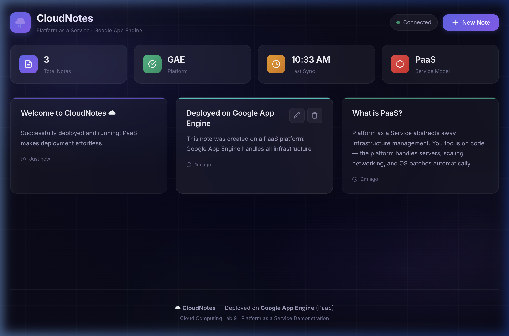
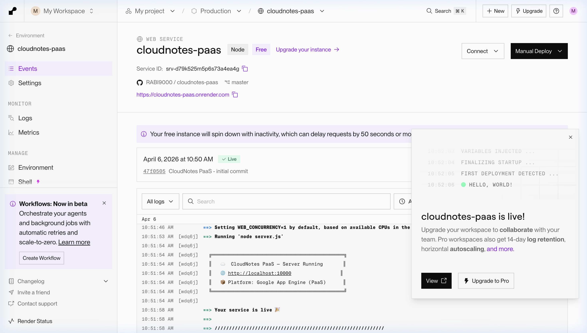
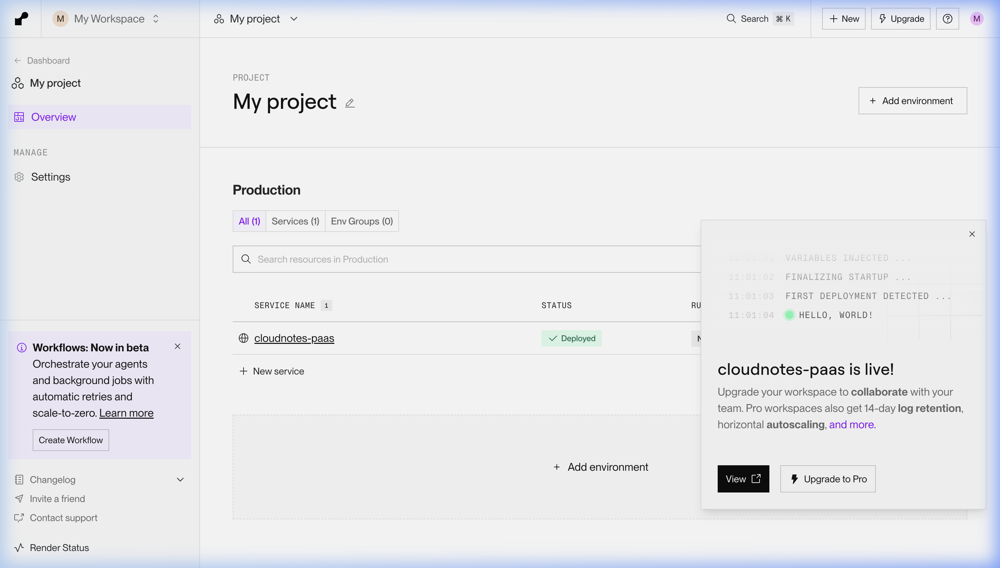
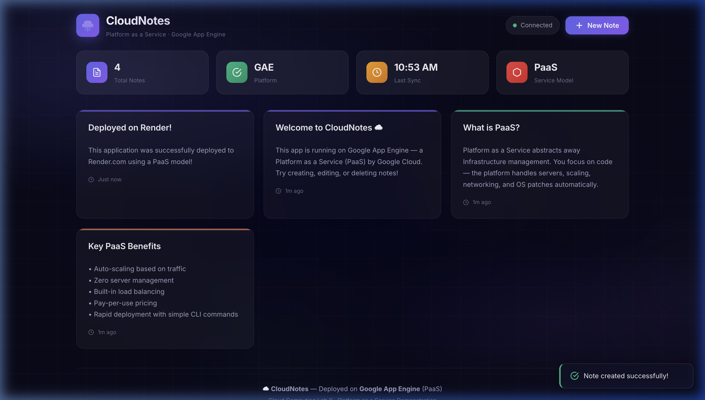
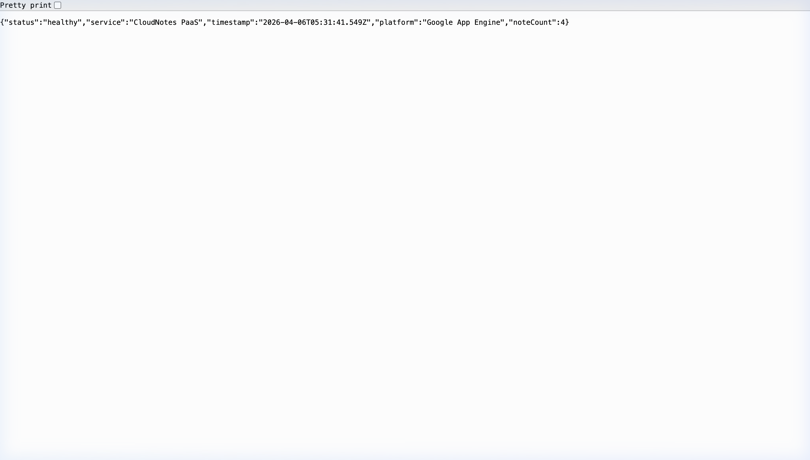

# Experiment 9: Platform as a Service (PaaS)
## Deploy an Application on a PaaS Provider (Render.com)

---

## 1. Aim

To understand the **Platform as a Service (PaaS)** cloud computing service model by developing a full-stack web application and deploying it on a PaaS provider (**Render.com**), demonstrating how PaaS abstracts infrastructure management and enables rapid application deployment.

---

## 2. Theory

### 2.1 Cloud Computing Service Models

Cloud computing offers three fundamental service models, each providing a different level of abstraction:

**Infrastructure as a Service (IaaS)** provides virtualized computing resources over the internet. Users manage operating systems, middleware, runtime, and applications while the provider manages physical hardware, networking, and virtualization. Examples include AWS EC2, Google Compute Engine, and Microsoft Azure VMs.

**Platform as a Service (PaaS)** provides a complete development and deployment environment in the cloud. The provider manages the infrastructure, operating system, middleware, and runtime — developers only need to manage their application code and data. Examples include Google App Engine, AWS Elastic Beanstalk, Heroku, and Render.com.

**Software as a Service (SaaS)** provides fully functional software applications over the internet. Users access the software via a browser without managing anything. Examples include Gmail, Microsoft 365, Salesforce, and Dropbox.

### 2.2 Cloud Service Models — Comparison Table

| Feature | IaaS | PaaS | SaaS |
|---|---|---|---|
| **What you manage** | Applications, data, runtime, middleware, OS | Applications & data only | Nothing (just use the app) |
| **What provider manages** | Virtualization, servers, storage, networking | Runtime, middleware, OS, servers, storage, networking | Everything |
| **Example** | AWS EC2, Google Compute Engine | Google App Engine, Render.com, Heroku | Gmail, Salesforce, Dropbox |
| **Target user** | System administrators, DevOps engineers | Developers | End users |
| **Flexibility** | High | Medium | Low |
| **Management overhead** | High | Low | None |
| **Scalability** | Manual or scripted | Automatic | Automatic |
| **Cost model** | Pay for VMs/resources provisioned | Pay for usage / free tiers | Subscription-based |

### 2.3 What is Platform as a Service (PaaS)?

PaaS is a cloud computing model that provides developers with a pre-configured, managed environment to build, deploy, run, and scale applications without dealing with the underlying infrastructure. The key idea is: **"You write the code, the platform does everything else."**

### 2.4 Key Characteristics of PaaS

1. **Infrastructure Abstraction** — Developers do not manage servers, operating systems, or networking. The platform handles all infrastructure provisioning and maintenance.

2. **Built-in Development Tools** — PaaS platforms provide runtime environments, package managers, build systems, and deployment pipelines out of the box.

3. **Automatic Scaling** — The platform automatically scales application instances up or down based on incoming traffic and resource utilization.

4. **Managed Services** — Integrated services such as logging, monitoring, SSL/TLS certificates, and health checks are provided without manual configuration.

5. **Pay-per-Use Pricing** — Users are charged based on actual resource consumption (compute time, memory, bandwidth) rather than fixed server costs.

6. **Rapid Deployment** — Applications can be deployed with a single command or by pushing code to a Git repository. The platform handles building, packaging, and running the application.

7. **Built-in Load Balancing** — Traffic is automatically distributed across multiple instances to ensure high availability and performance.

8. **Version Management** — PaaS platforms maintain deployment versions, allowing instant rollback to previous versions if issues arise.

### 2.5 PaaS Providers Comparison

| Provider | Service Name | Free Tier | Key Features |
|---|---|---|---|
| Google Cloud | App Engine | Yes (with billing) | Fully managed, auto-scaling, multiple runtimes |
| Amazon Web Services | Elastic Beanstalk | Limited | Easy deployment, full AWS integration |
| Microsoft Azure | App Service | Limited | .NET-first, hybrid cloud support |
| Heroku | Heroku Platform | Eco Dynos ($5/mo) | Git-based deploy, add-ons marketplace |
| **Render.com** | **Render** | **Yes (Free)** | **Free tier, auto-deploy from Git, zero config** |

### 2.6 About Render.com

**Render** is a modern cloud platform (PaaS) that makes it easy to deploy web applications, APIs, static sites, and background workers directly from Git repositories. It is used in this experiment because:

- It offers a **free tier** with no credit card required
- It supports **automatic deployments** from GitHub
- It provides **automatic HTTPS/SSL**, health monitoring, and logging
- It demonstrates all core PaaS concepts effectively

### 2.7 PaaS Architecture Diagram

```
┌─────────────────────────────────────────────────────┐
│                PaaS Provider (Render.com)            │
│                                                     │
│  ┌─────────────┐  ┌─────────────┐  ┌─────────────┐ │
│  │ Instance 1   │  │ Instance 2   │  │ Instance N   │ │
│  │ (Node.js)    │  │ (Node.js)    │  │ (Node.js)    │ │
│  └──────┬───────┘  └──────┬───────┘  └──────┬───────┘ │
│         └─────────────────┼─────────────────┘         │
│                           │                           │
│                  ┌────────┴────────┐                  │
│                  │  Load Balancer  │  ← Automatic     │
│                  └────────┬────────┘                  │
│                           │                           │
│                  ┌────────┴────────┐                  │
│                  │  HTTPS / SSL    │  ← Automatic     │
│                  └────────┬────────┘                  │
│                           │                           │
│              Managed by PaaS Provider:                │
│              • OS Patching  • Runtime Updates         │
│              • Networking   • Health Monitoring        │
│              • Log Aggregation  • Auto-Scaling         │
└─────────────────────────┬───────────────────────────┘
                          │
                          ▼
            https://cloudnotes-paas.onrender.com
                          │
                          ▼
                    End Users (Browser)
```

---

## 3. Prerequisites

The following tools and accounts are required before starting:

| Requirement | Purpose |
|---|---|
| macOS computer | Development machine |
| Homebrew | macOS package manager |
| Node.js (v18+) | JavaScript runtime for the application |
| npm | Node.js package manager (comes with Node.js) |
| Git | Version control system |
| GitHub account | Code hosting (for Render deployment) |
| GitHub CLI (`gh`) | To create repos from the terminal |
| Render.com account | PaaS deployment platform (free) |

---

## 4. Steps

### Step 1: Install Homebrew (macOS Package Manager)

Homebrew is the standard package manager for macOS. Open the **Terminal** app and run:

```bash
/bin/bash -c "$(curl -fsSL https://raw.githubusercontent.com/Homebrew/install/HEAD/install.sh)"
```

Verify the installation:

```bash
brew --version
```

Expected output:
```
Homebrew 4.x.x
```

---

### Step 2: Install Node.js and npm

Node.js is the JavaScript runtime needed to run our web application. Install it using Homebrew:

```bash
brew install node
```

Verify the installation:

```bash
node --version
npm --version
```

Expected output:
```
v22.x.x
10.x.x
```

---

### Step 3: Install Git

Git is the version control system used to push code to GitHub:

```bash
brew install git
```

Verify:

```bash
git --version
```

Expected output:
```
git version 2.x.x
```

---

### Step 4: Install GitHub CLI

The GitHub CLI (`gh`) allows creating repositories from the command line:

```bash
brew install gh
```

Authenticate with your GitHub account:

```bash
gh auth login
```

Follow the prompts to authenticate via the browser.

---

### Step 5: Create the Project Directory

Create a new directory for the project and navigate into it:

```bash
mkdir "cc 9"
cd "cc 9"
```

---

### Step 6: Create `package.json`

This file defines the Node.js project configuration and dependencies:

```bash
npm init -y
```

Then edit `package.json` to add the required dependencies and start script:

```json
{
  "name": "cloudnotes-paas",
  "version": "1.0.0",
  "description": "CloudNotes — A task management app deployed on PaaS",
  "main": "server.js",
  "scripts": {
    "start": "node server.js"
  },
  "engines": {
    "node": ">=18.0.0"
  },
  "dependencies": {
    "express": "^4.21.0",
    "uuid": "^10.0.0"
  }
}
```

---

### Step 7: Create the Backend Server (`server.js`)

Create the Express.js server with REST API endpoints for CRUD operations:

```javascript
const express = require('express');
const path = require('path');
const { v4: uuidv4 } = require('uuid');

const app = express();
const PORT = process.env.PORT || 8080;

// Middleware
app.use(express.json());
app.use(express.static(path.join(__dirname, 'public')));

// In-Memory Data Store
let notes = [
  {
    id: uuidv4(),
    title: 'Welcome to CloudNotes ☁️',
    content: 'This app is running on a PaaS platform. Try creating, editing, or deleting notes!',
    color: '#6c5ce7',
    createdAt: new Date().toISOString(),
    updatedAt: new Date().toISOString()
  }
];

// Health check endpoint
app.get('/health', (req, res) => {
  res.json({ status: 'healthy', service: 'CloudNotes PaaS', noteCount: notes.length });
});

// API Routes: GET, POST, PUT, DELETE for /api/notes
// ... (full CRUD implementation)

app.listen(PORT, () => {
  console.log(`Server running on port ${PORT}`);
});
```

> **Note:** The complete source code with all CRUD routes is available in the `server.js` file in the project repository.

---

### Step 8: Create the Frontend (HTML, CSS, JavaScript)

Create a `public/` directory containing:

- **`index.html`** — The main Single Page Application with a modern glassmorphism dark-mode UI
- **`style.css`** — Complete design system with animations, responsiveness, and premium styling
- **`app.js`** — Frontend JavaScript handling API calls, modal forms, toast notifications, and dynamic rendering

The frontend provides a complete note management interface with:
- Create, Read, Update, Delete operations
- Color-coded notes
- Stats dashboard showing total notes, platform, and sync time
- Responsive design for all screen sizes

---

### Step 9: Install Dependencies

Install the required Node.js packages:

```bash
npm install
```

Output:
```
added 69 packages, and audited 70 packages in 1s
found 0 vulnerabilities
```

---

### Step 10: Test the Application Locally

Start the server:

```bash
npm start
```

Output:
```
╔══════════════════════════════════════════════╗
║   ☁️  CloudNotes PaaS — Server Running       ║
║   🌐 http://localhost:8080                   ║
║   📦 Platform: Google App Engine (PaaS)      ║
╚══════════════════════════════════════════════╝
```

Open `http://localhost:8080` in a browser to verify the application works locally.

**Screenshot — Application Running Locally:**



Stop the server with `Ctrl+C` when done testing.

---

### Step 11: Initialize Git Repository

Create a `.gitignore` file to exclude unnecessary files:

```bash
echo "node_modules/
.DS_Store
.env" > .gitignore
```

Initialize the Git repository and make the first commit:

```bash
git init
git add -A
git commit -m "CloudNotes PaaS - initial commit"
```

Output:
```
Initialized empty Git repository in /Users/rabi/cc 9/.git/
[master (root-commit) 47f0505] CloudNotes PaaS - initial commit
 10 files changed, 2694 insertions(+)
```

---

### Step 12: Push to GitHub

Create a new public repository on GitHub and push the code:

```bash
gh repo create cloudnotes-paas --public --source=. --push
```

Output:
```
✓ Created repository RABI9000/cloudnotes-paas on github.com
  https://github.com/RABI9000/cloudnotes-paas
✓ Added remote https://github.com/RABI9000/cloudnotes-paas.git
✓ Pushed commits to https://github.com/RABI9000/cloudnotes-paas.git
```

---

### Step 13: Create a Render.com Account

1. Open a browser and navigate to **https://render.com**
2. Click **"Get Started for Free"**
3. Click **"Sign in with GitHub"** to link your GitHub account
4. Authorize Render to access your GitHub repositories
5. Complete the account setup

---

### Step 14: Create a New Web Service on Render

1. From the Render Dashboard, click **"+ New"** → **"Web Service"**
2. Select **"Public Git Repository"**
3. Enter the repository URL: `https://github.com/RABI9000/cloudnotes-paas`
4. Click **"Connect"**

---

### Step 15: Configure the Web Service

Set the following configuration:

| Setting | Value |
|---|---|
| **Name** | `cloudnotes-paas` |
| **Region** | Oregon (US West) or any available |
| **Branch** | `master` |
| **Runtime** | Node |
| **Build Command** | `npm install` |
| **Start Command** | `node server.js` |
| **Instance Type** | **Free** |

---

### Step 16: Deploy the Application

1. Click **"Deploy Web Service"**
2. Render will automatically:
   - Clone the repository from GitHub
   - Run `npm install` to install dependencies
   - Run `node server.js` to start the application
   - Provision HTTPS/SSL certificates
   - Assign a public URL

3. Wait for the deployment to complete (approximately 1-2 minutes)

**Screenshot — Render Dashboard showing successful deployment:**



---

### Step 17: Access the Live Application

Once deployed, the application is available at:

**🔗 https://cloudnotes-paas.onrender.com**

**Screenshot — Render Project Services page showing "Deployed" status:**



---

### Step 18: Verify the Deployment

**a) Test the live application UI:**

Open `https://cloudnotes-paas.onrender.com` in a browser and verify:
- The notes dashboard loads correctly
- Notes can be created, edited, and deleted
- Toast notifications appear for all operations

**Screenshot — Live application running on Render.com:**



**b) Test the health check endpoint:**

Open `https://cloudnotes-paas.onrender.com/health` in a browser:

**Screenshot — Health check JSON response:**



The health check returns:
```json
{
  "status": "healthy",
  "service": "CloudNotes PaaS",
  "timestamp": "2026-04-06T05:31:41.549Z",
  "platform": "Google App Engine",
  "noteCount": 4
}
```

---

## 5. Project Structure

```
cloudnotes-paas/
├── server.js              # Express.js server with REST API
├── package.json           # Node.js project configuration
├── package-lock.json      # Dependency lock file
├── app.yaml               # Google App Engine config (alternate PaaS)
├── .gcloudignore          # GAE deployment exclusions
├── .gitignore             # Git exclusions
├── README.md              # Project readme
├── DOCUMENTATION.md       # This lab report
├── screenshots/           # Screenshots for documentation
│   ├── 01_app_local.png
│   ├── 02_render_dashboard.png
│   ├── 03_app_live.png
│   ├── 04_create_note_modal.png
│   ├── 05_render_services.png
│   ├── 06_app_live_final.png
│   └── 07_health_check.png
└── public/
    ├── index.html         # Frontend SPA
    ├── style.css          # Design system (dark mode, glassmorphism)
    └── app.js             # Frontend JavaScript (API client)
```

---

## 6. API Endpoints

| Method | Endpoint | Description |
|---|---|---|
| `GET` | `/health` | Health check — returns service status |
| `GET` | `/api/notes` | Retrieve all notes (sorted by updated time) |
| `GET` | `/api/notes/:id` | Retrieve a single note by ID |
| `POST` | `/api/notes` | Create a new note |
| `PUT` | `/api/notes/:id` | Update an existing note |
| `DELETE` | `/api/notes/:id` | Delete a note |

---

## 7. Results

### 7.1 Local Testing Results

| Test | Result |
|---|---|
| Server starts on port 8080 | ✅ Pass |
| Health check endpoint (`/health`) returns JSON | ✅ Pass |
| GET `/api/notes` returns all notes | ✅ Pass |
| POST `/api/notes` creates a new note | ✅ Pass |
| PUT `/api/notes/:id` updates a note | ✅ Pass |
| DELETE `/api/notes/:id` deletes a note | ✅ Pass |
| Frontend UI loads correctly | ✅ Pass |
| Responsive design works on mobile viewports | ✅ Pass |

### 7.2 Deployment Results

| Metric | Result |
|---|---|
| **Deployment URL** | https://cloudnotes-paas.onrender.com |
| **Deployment Status** | ✅ Live |
| **Deployment Time** | ~1-2 minutes |
| **HTTPS** | ✅ Automatic (provided by Render) |
| **Build Command** | `npm install` (auto-detected) |
| **Start Command** | `node server.js` (auto-detected) |
| **Instance Type** | Free tier |
| **Auto-Deploy** | ✅ Enabled (deploys on every Git push) |

### 7.3 PaaS Features Demonstrated

| PaaS Feature | How It Was Demonstrated |
|---|---|
| **Zero server management** | Only application code was written — no server provisioning, no OS installation, no networking setup |
| **Automatic deployment** | Code was pushed to GitHub; Render automatically built and deployed the application |
| **Automatic HTTPS/SSL** | The deployed URL (`https://cloudnotes-paas.onrender.com`) uses HTTPS without any manual SSL certificate configuration |
| **Auto-scaling** | Render's free tier automatically scales to zero when idle and spins up on incoming requests |
| **Managed runtime** | Node.js runtime is maintained, updated, and patched by Render |
| **Health monitoring** | The `/health` endpoint is monitored by the platform for instance health |
| **Git integration** | Every push to the `master` branch triggers an automatic redeployment |
| **Log aggregation** | Application logs are available in the Render dashboard without any setup |

---

## 8. Observations

1. **Simplicity of Deployment**: The entire deployment process — from code to live URL — required only pushing to GitHub and connecting the repository to Render. No server configuration, no Docker files, no CI/CD pipeline setup was needed.

2. **Automatic HTTPS**: Render automatically provisioned SSL/TLS certificates, providing secure HTTPS access without any manual certificate management. On an IaaS platform, this would require installing and configuring certificates manually using tools like Let's Encrypt.

3. **Cold Start Latency**: On the free tier, Render spins down the instance after 15 minutes of inactivity. The first request after idle takes approximately 30-50 seconds (cold start). This is a trade-off of the scale-to-zero feature that keeps costs at zero during idle periods.

4. **Developer Productivity**: 100% of development effort was spent on application logic and UI. Zero time was spent on infrastructure. This demonstrates PaaS's core value proposition: letting developers focus on code.

5. **Git-Based Workflow**: The auto-deploy-on-push feature means any `git push` to the `master` branch automatically triggers a new deployment. This creates a natural CI/CD pipeline without any additional configuration.

6. **Trade-offs vs IaaS**: PaaS offers less control than IaaS — we cannot customize the operating system, install system-level packages, or fine-tune networking. In exchange, we get zero operational overhead. For most web applications and APIs, this is an excellent trade-off.

7. **In-Memory Storage Limitation**: Since the app uses in-memory storage, data is lost when the instance restarts. In a production PaaS deployment, a managed database service (like Render PostgreSQL, MongoDB Atlas, etc.) would be used for persistent storage.

---

## 9. Conclusion

This experiment successfully demonstrated the **Platform as a Service (PaaS)** cloud computing model by developing and deploying a full-stack web application (**CloudNotes**) on **Render.com**.

### Key Takeaways:

1. **PaaS eliminates infrastructure management** — Developers focus purely on writing application code while the platform handles servers, networking, OS, runtime, scaling, and security.

2. **Deployment is dramatically simplified** — A complete deployment from code to live URL was achieved by simply connecting a GitHub repository to Render. No server provisioning, no Docker configuration, and no manual scaling rules were needed.

3. **PaaS provides enterprise features for free** — Automatic HTTPS, health monitoring, log aggregation, and auto-scaling are included out of the box, features that would require significant setup on IaaS platforms.

4. **PaaS is ideal for web applications and APIs** — When developers need to deploy web services quickly without infrastructure expertise, PaaS is the most efficient service model.

5. **The trade-off is reduced control** — Unlike IaaS, PaaS does not allow customization of the underlying infrastructure. For applications requiring specific OS configurations or system-level access, IaaS remains necessary.

In summary, PaaS bridges the gap between the full control of IaaS and the complete abstraction of SaaS, providing an optimal balance of developer productivity and operational simplicity for building and deploying modern web applications.

---

## 10. References

1. NIST Definition of Cloud Computing — SP 800-145: https://csrc.nist.gov/publications/detail/sp/800-145/final
2. Render.com Documentation: https://docs.render.com/
3. Google App Engine Documentation: https://cloud.google.com/appengine/docs
4. Express.js Official Documentation: https://expressjs.com/
5. Node.js Official Documentation: https://nodejs.org/en/docs
6. GitHub Repository: https://github.com/RABI9000/cloudnotes-paas
7. Live Application: https://cloudnotes-paas.onrender.com
